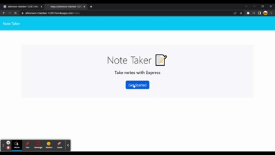

# 11 Express.js: Note Taker

## Link to Deployed Application

https://afternoon-chamber-12281.herokuapp.com/

## Description

In this assignment, I was given a starter code filled with front end development. The challenge was to create an application called Note Taker that can be used to write and save notes. To bulid a link by making a back end application connect to front end. The benefits from this application can be used to drop down thoughts and review for later as it will save as many notes as needed. At first, I was having a hard time understanding how and where my routes were getting errors. Later to find out that I added an extra route that was taken to a route that did not exist. This helps understand how back end communicates to front end applications.

## User Story

```
AS A small business owner
I WANT to be able to write and save notes
SO THAT I can organize my thoughts and keep track of tasks I need to complete
```


## Acceptance Criteria

```
GIVEN a note-taking application
WHEN I open the Note Taker
THEN I am presented with a landing page with a link to a notes page
WHEN I click on the link to the notes page
THEN I am presented with a page with existing notes listed in the left-hand column, plus empty fields to enter a new note title and the note’s text in the right-hand column
WHEN I enter a new note title and the note’s text
THEN a Save icon appears in the navigation at the top of the page
WHEN I click on the Save icon
THEN the new note I have entered is saved and appears in the left-hand column with the other existing notes
WHEN I click on an existing note in the list in the left-hand column
THEN that note appears in the right-hand column
WHEN I click on the Write icon in the navigation at the top of the page
THEN I am presented with empty fields to enter a new note title and the note’s text in the right-hand column
```

## Quick Demostration of the Application



## Installation

 - Node.js
 - Express.js
 - uuid
 - Json

## Credits

Tiger Nguyen

